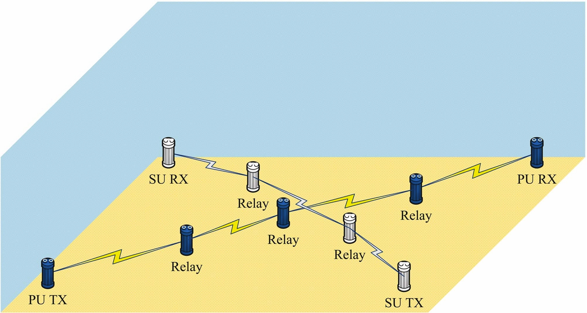
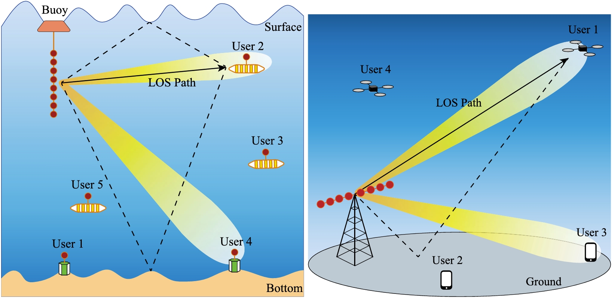
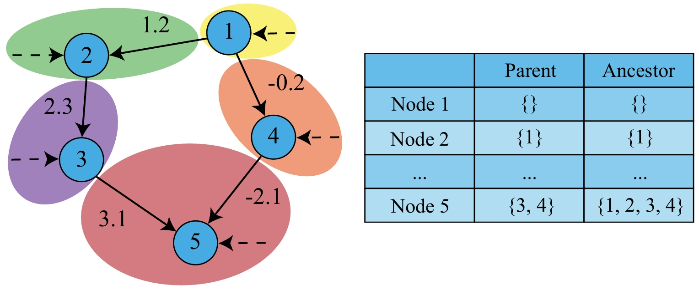



---

## Cognitive Scheduling for Multihop Underwater Acoustic Networks
The major goal of this project is to investigate optimal scheduling for a cognitive multihop underwater acoustic network with a primary user interference constraint. The network consists of primary and secondary users, with multihop transmission adopted for both user types to provide reliable communications. Key characteristics of underwater acoustic channels, including large propagation delay, distance-and-frequency dependent attenuation, half-duplex modem and inter-hop interference are taken into account in the design and analysis. In particular, time-slot allocation is found to be more effective than frequency slot allocation due to the underwater channel model. The goal of the network scheduling problem is to maximize the end-to-end throughput of the overall system, while limiting the throughput loss of primary users. Both centralized and decentralized approaches are considered. The framework of Partially Observable Markov Decision Processes (POMDP) is applied to formulate the optimization problem and an optimal dynamic programming algorithm is derived. Key properties are shown for the objective function, enabling the design of approximate schemes with significant complexity reduction. Numerical results show the proposed schemes significantly increase system throughput and while maintaining the primary throughput loss constraint. Under certain traffic conditions, the throughput gain over frequency-slot allocation schemes can be as high as 55%.  
  
Related Papers: [WUWNet_22](https://dl.acm.org/doi/abs/10.1145/3567600.3568143), [JOE_23](https://ieeexplore.ieee.org/abstract/document/10403107)  

## Multiuser Space-Time Division Scheduling in Underwater Acoustic Networks with Fairness
In this project, we investigate space-time scheduling for multi-user networks under fairness considerations. Scheduling is formulated as a sequential decision-making problem under the Markov Decision Processes (MDP) framework. Although the initial focus of the work is underwater acoustic networks, the proposed strategies are also validated for terrestrial radio frequency networks. If environment exploration is expensive, planning is more efficient than online learning. A challenge of the proportional fairness is that the additive structure between current and future rewards does not hold. An approximate reward function that is additive is proposed, enabling dynamic programming. Computational complexity is addressed through sample-based approximations. Error accumulation and error bounds are analyzed to show that error decays with time. As mobility induces model-shifts, a novel re-planning scheme is proposed to optimize the timings of policy updates. Numerical results show that the proposed scheme significantly improves network capacity while maintaining a high level of fairness. Furthermore, the proposed approach yields average capacity and fairness gains as high as 37% and 27%, respectively, compared to current approaches.  
  
Related Papers: [Asilomar_23](https://ieeexplore.ieee.org/abstract/document/10476989), [TWC_24](https://ieeexplore.ieee.org/abstract/document/10648649)  

## Low Complexity Causal Bandits with Asymmetric Graph Error Control ##
This project considers the causal bandit problem, in which the objective is to select an optimal sequence of interventions on nodes in a causal graph. It is assumed that the graph is governed by linear structural equations; it is further assumed that both the causal topology and the distribution of interventions are unknown. By exploiting the causal relationships between the nodes whose signals contribute to the reward, interventions are optimized. First, based on the difference between the two types of graph identification errors (false positives and negatives), a causal graph learning method is proposed, which strongly reduces sample complexity relative to the prior art by learning sub-graphs. Under the assumption of Gaussian exogenous inputs and minimum-mean squared error weight estimation, a new uncertainty bound tailored to the causal bandit problem is derived. This uncertainty bound drives an upper confidence bound based intervention selection to optimize the reward. To cope with non-stationary bandits, a sub-graph change detection mechanism is proposed, with high sample efficiency. Numerical results compare the new methodology to existing schemes and show a substantial performance improvement in both stationary and non-stationary settings. Compared to existing approaches, the proposed scheme takes 67% fewer samples to learn the causal structure and achieves an average reward gain of 85%.  
  
Related Papers: [ICASSP_24](https://ieeexplore.ieee.org/abstract/document/10445823)  
